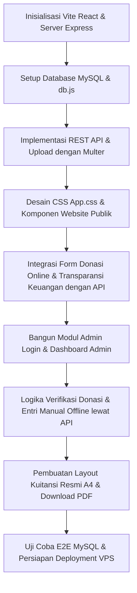

# Rencana Implementasi (Diperbarui): Website & Sistem Donasi Full-Stack MySQL Yayasan Nurul Aitam Karawang

Menyediakan solusi digital premium terintegrasi untuk **Yayasan Yatim Piatu Nurul Aitam Karawang** (berdiri sejak 1999) dengan arsitektur **Full-Stack (React + Node.js/Express + MySQL)** yang siap dideploy ke VPS. Sistem ini mencakup portal informasi publik, galeri kegiatan, transparansi donasi dinamis, dashboard admin canggih, verifikasi bukti transfer, pencatatan donasi offline, dan ekspor kuitansi resmi PDF.

---

## 🛠️ Arsitektur Sistem & Pilihan Teknologi (Full-Stack)

Aplikasi akan dibagi menjadi dua bagian utama di dalam satu repositori (*monorepo* terstruktur) untuk memudahkan pengembangan dan deployment ke VPS:

1. **Frontend (Klien)**:
   - **Framework**: React + Vite + Vanilla CSS premium.
   - **Tipografi**: Google Fonts **Outfit** & **Inter** dengan palet warna *Deep Emerald Green* (`hsl(150, 70%, 12%)`) dan *Amber Gold* (`hsl(45, 90%, 50%)`).
   - **Ekspor PDF**: Pustaka *html2pdf.js* beresolusi tinggi di sisi klien untuk pengunduhan kuitansi langsung tanpa membebani memori server VPS.

2. **Backend (Server API)**:
   - **Runtime**: Node.js dengan framework **Express**.
   - **Database**: **MySQL** untuk penyimpanan persisten berkinerja tinggi di VPS.
   - **File Upload**: *Multer* untuk memproses unggahan bukti transfer donatur dengan aman.
   - **Autentikasi**: *JSON Web Tokens (JWT)* atau *Session* untuk mengamankan dashboard admin.
   - **Variabel Lingkungan**: *dotenv* untuk konfigurasi fleksibel (kredensial database, port, dll.).

3. **Alur Produksi & VPS Deployment**:
   - Saat pengembangan: Vite berjalan di port `5173` dengan proxy API otomatis ke server Express di port `5000`.
   - Saat produksi di VPS: React dibuild menjadi file statis (`npm run build`), dan server Express akan melayani file statis tersebut secara langsung serta menyediakan API. Ini memudahkan setup karena **hanya perlu menjalankan satu proses Node.js di VPS** (menggunakan PM2).

---

## 🗄️ Skema Database MySQL (`schema.sql`)

Tabel utama yang akan dibuat di MySQL:

```sql
CREATE DATABASE IF NOT EXISTS nurulaitam_db;
USE nurulaitam_db;

-- Tabel Admin untuk login pengurus yayasan
CREATE TABLE IF NOT EXISTS admins (
    id INT AUTO_INCREMENT PRIMARY KEY,
    username VARCHAR(50) NOT NULL UNIQUE,
    password VARCHAR(255) NOT NULL, -- Password terenkripsi bcrypt
    name VARCHAR(100) NOT NULL,
    created_at TIMESTAMP DEFAULT CURRENT_TIMESTAMP
);

-- Tabel Donasi (Online & Offline)
CREATE TABLE IF NOT EXISTS donations (
    id INT AUTO_INCREMENT PRIMARY KEY,
    invoice_number VARCHAR(50) UNIQUE DEFAULT NULL, -- Dihasilkan otomatis saat disetujui (misal: NA-2026-0001)
    donor_name VARCHAR(100) NOT NULL,
    donor_whatsapp VARCHAR(20) NOT NULL,
    donor_email VARCHAR(100) DEFAULT NULL,
    amount DECIMAL(15, 2) NOT NULL,
    program_name VARCHAR(100) NOT NULL,            -- Program yayasan (cth: Minggu Ceria, Tadabur Alam, dll.)
    payment_method VARCHAR(50) NOT NULL,           -- BCA, Mandiri, Tunai, WhatsApp Manual
    receipt_proof VARCHAR(255) DEFAULT NULL,       -- Path nama file bukti transfer donatur online
    status ENUM('PENDING', 'APPROVED', 'REJECTED') DEFAULT 'PENDING',
    donation_type ENUM('ONLINE', 'OFFLINE') NOT NULL, -- Membedakan asal donasi
    message TEXT DEFAULT NULL,                     -- Pesan / doa dari donatur
    created_at TIMESTAMP DEFAULT CURRENT_TIMESTAMP,
    verified_at TIMESTAMP NULL DEFAULT NULL
);
```

---

## 📂 Struktur Direktori Proyek

```
/nurulaitam
├── package.json                # Skrip monorepo (start, dev, build)
├── schema.sql                  # File backup skema database MySQL
├── .env.example                # Contoh konfigurasi database & port
├── .env                        # Konfigurasi aktif (diabaikan dari Git)
│
├── /server                     # --- BACKEND EXPRESS & MYSQL ---
│   ├── index.js                # Entrypoint server Express
│   ├── db.js                   # Koneksi pool MySQL (mysql2/promise)
│   ├── /uploads                # Folder penyimpanan gambar bukti transfer
│   └── /routes                 # Logika API endpoints
│
└── /src                        # --- FRONTEND REACT ---
    ├── main.jsx
    ├── App.jsx                 # Router publik & admin, state global
    ├── App.css                 # Tema Emerald-Gold, Desain Glassmorphism
    ├── /data                   # Data statis lokal (artikel, galeri kegiatan, prestasi)
    └── /components
        ├── Navbar.jsx          # Header navigasi melayang
        ├── Hero.jsx            # Banner & metrik statistik
        ├── About.jsx           # Sejarah, pengurus, & penghargaan
        ├── Programs.jsx        # Grid Program Unggulan
        ├── Gallery.jsx         # Dokumentasi kegiatan anak-anak
        ├── Transparency.jsx   # Laporan grafik bulanan & tabel mutasi real-time (API)
        ├── Donate.jsx          # Form donasi online & upload file (API)
        ├── Articles.jsx        # Berita & dakwah
        ├── AdminLogin.jsx      # Autentikasi admin
        ├── AdminDashboard.jsx  # Konsol manajemen donasi, verifikasi, input offline (API)
        └── ReceiptPDF.jsx      # Cetakan kuitansi A4 resmi dengan stempel & tanda tangan
```

---

## 📝 Langkah-Langkah Detil Implementasi



### Tahap 1: Setup Proyek & Database MySQL
- Membuat proyek React dengan Vite di direktori utama:
  `npx -y create-vite@latest ./ --template react --no-interactive`
- Membuat folder `/server` dan menginisialisasi server Node.js.
- Menginstal dependensi backend: `express`, `mysql2`, `multer`, `cors`, `dotenv`, `bcryptjs`, `jsonwebtoken`.
- Mengonfigurasi `db.js` untuk membuat pool koneksi MySQL dan secara otomatis menginisialisasi tabel-tabel di atas jika belum ada (mempermudah setup lokal pertama kali).

### Tahap 2: Pengembangan API Backend (Express)
- **Rute Publik**:
  - `POST /api/donations` -> Menerima donasi online, menyimpan data ke database dengan status `PENDING`, memproses unggahan gambar bukti transfer ke folder `/server/uploads`.
  - `GET /api/donations/public` -> Menghasilkan data donasi yang telah diverifikasi (`APPROVED`) untuk transparansi keuangan di halaman depan.
  - `GET /api/donations/stats` -> Mengembalikan data agregat (Total donasi terkumpul, jumlah donatur, tren bulanan) untuk divisualisasikan dalam grafik SVG di halaman utama.
- **Rute Admin**:
  - `POST /api/admin/login` -> Memverifikasi username & password admin, menghasilkan token JWT.
  - `GET /api/admin/donations` -> Mengembalikan seluruh data donasi (termasuk pending & offline) untuk tabel kelola admin.
  - `POST /api/admin/donations/offline` -> Mencatat donasi offline langsung ke database dengan status langsung `APPROVED` dan menerbitkan nomor kuitansi unik.
  - `PUT /api/admin/donations/:id/verify` -> Memverifikasi donasi online. Mengubah status menjadi `APPROVED` / `REJECTED`, menghasilkan nomor kuitansi berformat *NA-YYYY-XXXX*, dan memperbarui `verified_at`.

### Tahap 3: Pembuatan Tampilan Website Publik (Front-End)
- Menghubungkan komponen React publik dengan Express API menggunakan `fetch`.
- **Form Donasi**: Donatur mengisi data diri, memilih nominal, mentransfer ke nomor rekening yayasan yang tertera, mengunggah bukti transfer, lalu mengirim data ke backend.
- **Transparansi Keuangan**: Laporan total nominal terhimpun disajikan secara real-time dari database. Grafik keuangan SVG dibuat responsif menggambarkan tren donasi bulanan. Tabel donasi publik memuat daftar nama donatur terverifikasi, jumlah, tanggal, dan tombol **Unduh Kuitansi PDF**.

### Tahap 4: Panel Dashboard Admin & Ekspor PDF
- Admin dapat melihat daftar antrean verifikasi secara real-time dengan gambar bukti transfer yang dapat diklik untuk pratinjau penuh.
- Ketika admin menekan tombol "Verifikasi & Buat Kuitansi", API dipanggil dan state diperbarui.
- Disediakan tombol **Unduh PDF** yang memuat komponen kuitansi `ReceiptPDF` dalam wadah tersembunyi yang dioptimalkan untuk cetak A4. Pustaka *html2pdf.js* dipanggil untuk menghasilkan file PDF yang sangat rapi dan tajam (lengkap dengan kop surat, stempel yayasan, tanda tangan ketua **Dra. Hj. Nina Helmina, M.M**, QR Code verifikasi, dan penyebutan terbilang nominal).

---

## 📊 Rencana Verifikasi & Pengujian VPS

1. **Uji Konektivitas Database**:
   - Memastikan server backend Express dapat membuat koneksi MySQL tanpa hambatan dan mencetak pesan sukses di log konsol.
2. **Uji Pengiriman Donasi Online**:
   - Mengisi form donasi di frontend publik -> Mengunggah file gambar -> Mengirim.
   - Memeriksa database MySQL: Pastikan baris baru terisi di tabel `donations` dengan nama file gambar yang tepat di kolom `receipt_proof` dan status `PENDING`.
3. **Uji Verifikasi & Kuitansi PDF**:
   - Login admin -> Klik **Approve** pada antrean donasi.
   - Memeriksa database MySQL: Pastikan status berubah menjadi `APPROVED`, kolom `invoice_number` terisi (misal: *NA-2026-0001*), dan tanggal verifikasi tersimpan.
   - Klik **Download PDF** -> Pastikan file terunduh dengan layout kuitansi resmi berstempel dan tertanda tangani rapi.
4. **Uji Transparansi Publik**:
   - Cek halaman depan website publik: Pastikan donasi terverifikasi tersebut telah masuk ke dalam tabel transparansi dan grafik tren bulanan terupdate otomatis.
